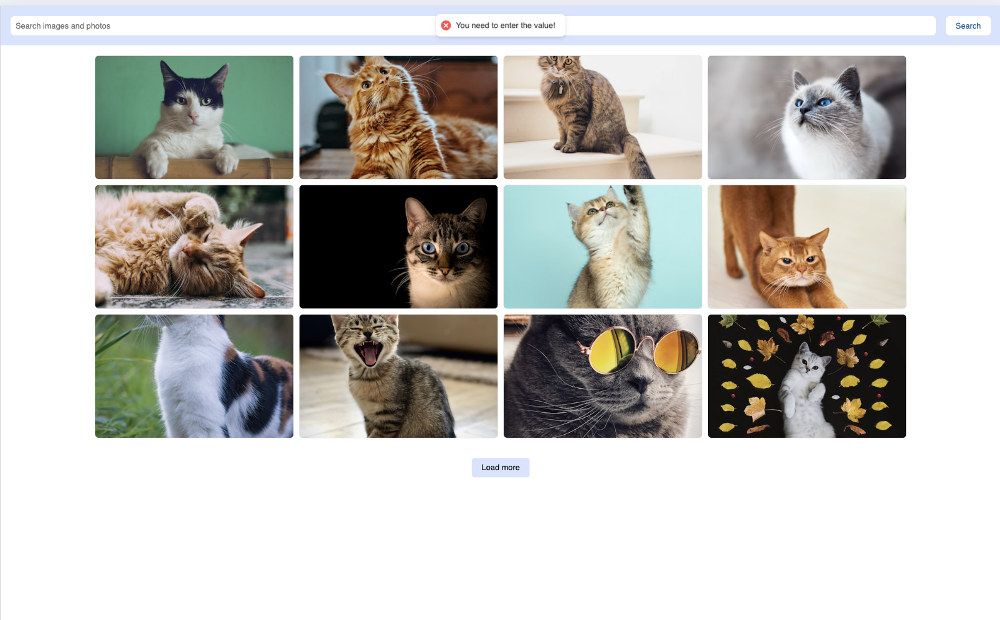

# 🖼️ React Image Searching Service

A responsive image search app built with **React** and **Vite**, using the **Pixabay API** to fetch images.  
Users can type a query to get matching images displayed in a gallery, and click any image to see a larger version in a modal window.  
Deployed on [**Vercel**](https://vercel.com).

---

## 🛠️ Tech Stack

- **React**
- **Vite**
- **Axios**
- **Pixabay REST API**
- **Custom Modal**
- **Responsive Layout**
- **Form Validation**

---

## ✨ Features

- Keyword-based image search
- Display results in a gallery layout
- Modal window to preview full-size image
- Responsive design for mobile, tablet, and desktop
- "Load more" button for pagination
- Prevents empty query submission with validation

---

## 🔗 Live Demo

👉 [View Live](https://react-image-searching-service.vercel.app)

---

## 📸 Screenshots

|  |  |
|:--:|:--:|
| **Search Field** – user types a keyword to start image search. | **Tablet Layout** – images displayed in two columns on medium screens. |

|  |  |
|:--:|:--:|
| **Gallery Layout** – responsive multi-column display of results. | **Validation** – prevents searching with an empty field. |

|  |
|:--:|
| **Modal Preview** – full-size image opens in modal window. |

---

## ✅ Status

✅ Project is complete and working as intended.
